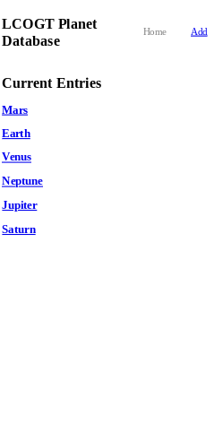
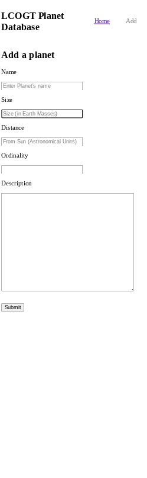
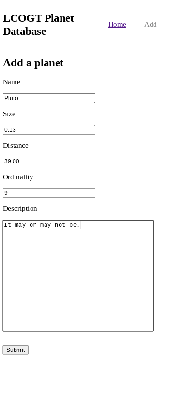
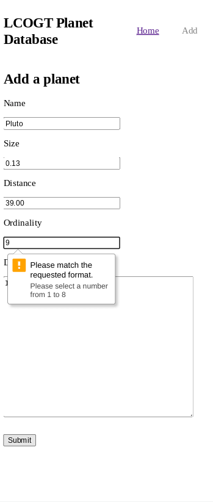
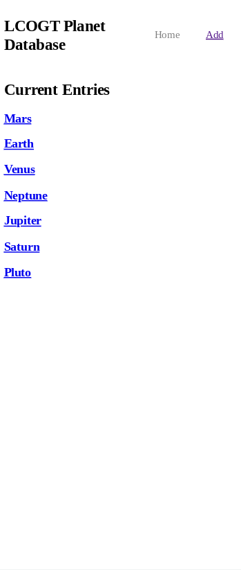
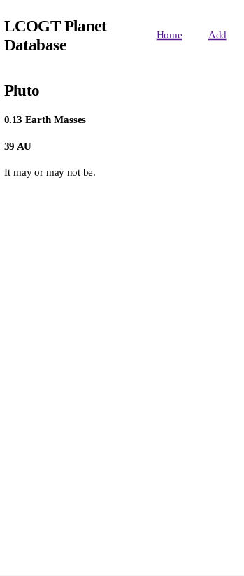
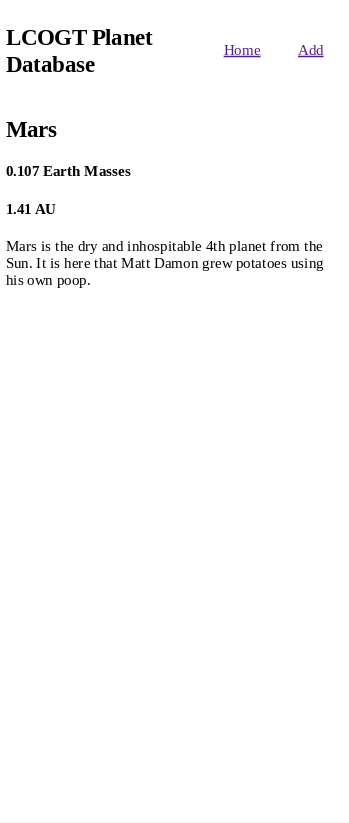

# Take Home Interview Project

This is my solution to a past interview challenge from [LCOGT](https://github.com/LCOGT). 

## Screenshots 



***



***



***



***



***



***



***

## Directions

Create a web application where a user can view and add planets to a database.

### Estimated time for completion:
2-4 Hours

### Instructions
Use whatever programming language/framework that is most comfortable to you. The deliverable
product should be the sourcecode to a runnable web application with all the requirements met.
The database should be blank: you do not need to provide any data with the deliverable.

Place any special setup instructions in a file called SETUP.

Using github, you should fork this repository ([Github: how to fork a repository](https://help.github.com/articles/fork-a-repo/)) and add the code you have written to it. When you are done, open a pull request. It will then be reviewed.

## Requirements

#### The homepage

The homepage should contain a list or table of the planets that have been added to the database
along with their name, size, distance and ordinality.

For example:

    Ordinality  Name     Size    Distance
    1           Mercury  0.05    0.34
    2           Venus    0.08    0.72

The name of the object should link to that object's detail page.

#### The input form

A simple form for adding a planet to the database. The form should have 5 inputs:
Name, Size (in Earth Masses), Distance (from the sun, In Astronomical Units), Ordinality (Mercury: 1, Neptune: 8)
and Description.

For example:

          ____          ____              ____                ____
    Name |____|   Size |____|   Distance |____|   Ordinality |____|
                  __________________________________
    Description: |                                  |
                 |                                  |
                 |__________________________________|
     ______
    |SUBMIT|

Name and ordinality should be unique. Size, Ordinality and Distance should be restricted to numerical input.

#### The detail page
The detail page should simply display all the available information about the planet.

For example:

    Mars
    Mars is the dry and inhospitable 4th planet from the Sun. It is here that Matt Damon
    grew potatoes using his own poop.

    Ordinality: 4
    Size: 0.107 Earth Masses
    Distance: 1.41 AU

### Hints

1. Use sqlite/memory/flat files instead of something like mysql or postgresql to store data. This will make the setup much less complicated.

2. Don't worry about styling: the pages don't have to be pretty, just functional.

### Bonus
Provide an application that can serve multiple users, with a backend component as opposed to a pure client side application.

## My Process

## Built With

- express
- ejs
- sqlite3

## How to Use

To clone and run this application, you'll need [Git](https://git-scm.com) and [Node.js](https://nodejs.org/en/download/) (which comes with [npm](http://npmjs.com)) installed on your computer. From your command line:

```bash
# Clone this repository 
$ git clone https://jdegand.github.io/LCOGT-takehomeinterview

# Install dependencies
cd LCOGT-takehomeinterview
$ npm install

# run server and go to http://localhost:3000
$ npm start
```

## Thoughts

- Used pattern attribute with regular expression for form validation
- Less documentation and good examples to follow when working with SQLite and Express

## Useful Resources

- [Stack Exchange](https://codereview.stackexchange.com/questions/128036/restrict-html-input-field-to-decimal#:~:text=You%20are%20only%20allowing%20zero,d%7B0%2C4%7D%20.) - restrict html input field to decimal
- [YouTube](https://www.youtube.com/watch?v=qdV9S7UE99o) - How to use a SQLite Database with Nodejs (web app tutorial part 2)
- [Stack Overflow](https://stackoverflow.com/questions/56095635/how-to-concatenate-strings-in-an-html-attribute-using-ejs) - ejs concatenation
- [Wikipedia](https://en.wikipedia.org/wiki/Earth_mass#:~:text=The%20current%20best%20estimate%20for,six%20ronnagrams%2C%20or%206.0%20Rg.) - Earth Mass
- [Stack Overflow](https://stackoverflow.com/questions/5372559/what-is-the-proper-way-to-check-for-existence-of-variable-in-an-ejs-template-us) - check for variable in ejs template
